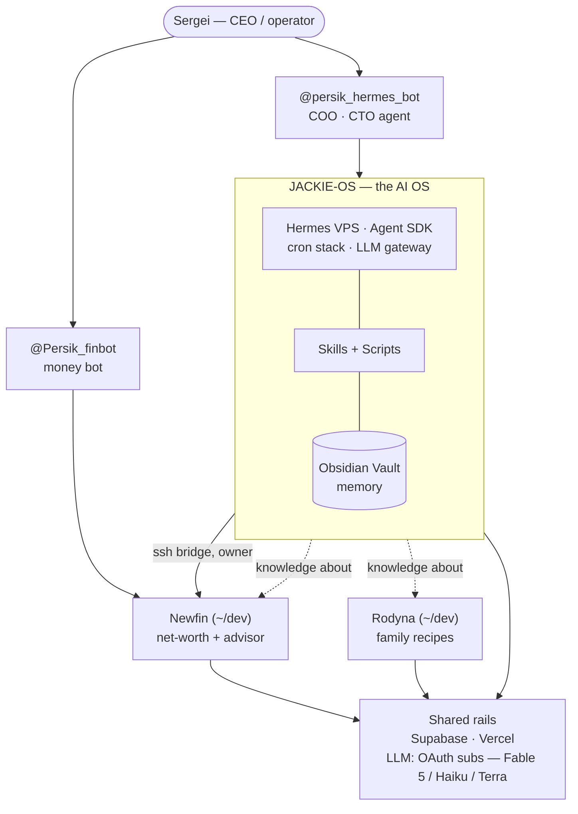

**One operator, three systems, one spine.** Jackie-OS is the always-on AI operating layer; Newfin and Rodyna are independent product repos that ride the same shared rails. The spine is **Hermes** (the VPS gateway): the single LLM gateway, the cron host, and the SSH bridge into Newfin.

> **Quick rule for agents:** code lives in `~/dev/{newfin,rodyna,draw}` (CTO territory). *Knowledge about* the code lives in the vault (`Vault/Newfin.md`, `Vault/Rodyna.md`). Technical fix write-ups live in each repo's `docs/solutions/`. Don't confuse the two.

Solid = data/control flow · dotted `knowledge about` = vault notes, not code · Newfin &#38; Rodyna would run without Jackie-OS; Hermes is what makes it one OS.

---

## 1. Jackie-OS — the AI operating system

Sergei's always-on OS. The **vault is memory**, **skills are the contract**, **scripts are dumb runners**, **Hermes is the 24/7 instance** on a VPS. Tool-agnostic: any agent that opens `~/Jackie-OS` and reads `CLAUDE.md` *becomes* an instance. Hosts four code repos (Newfin, Rodyna, Draw, B-Unit) and multiple products/projects (B-Unit, Peaches Beauty, Nastusha), all synced to the vault via `project-sync`.

- **Stack:** Obsidian (markdown) · bash/Python runners · Claude Agent SDK · VPS cron (Europe/Warsaw) · git + symlink farm · Telegram Bot API.
- **Layers:**
  - **Vault** (`Vault/`) — journals, project notes, briefs, coaching corpus, ops board, `Agent-Learnings/` index. Source of truth.
  - **Skills** (`System/skills/`) — markdown agent specs (morning-brief, project-sync, research, wrap-up, coaching, …).
  - **Scripts** (`System/{coo,capture,ops,periodic,work,lib}/`) — edited in repo, run on VPS via a **symlink farm** (`~/.hermes/scripts/&#60;name>` → repo). Repo is the source of truth; never edit the VPS copy.
    - **Script groups by function:**
      - `coo/` — COO ops (brief delivery, Telegram integration, vault index updates)
      - `capture/` — journal capture, Telegram sweep, trade digest, meeting capture
      - `ops/` — VPS service health, Hermes ops proxy, code exec gate, notify endpoint
      - `periodic/` — intel weekly, codebase index (`cbm`), janitor maintenance
      - `work/` — ad-hoc agent work (code ask, wrap-up ops)
      - `lib/` — shared utilities (env loader, logging helpers)
  - **Secrets** (`.secrets/*.env`) — gitignored, mode 0600.
- **Hermes VPS** (`hermes@your-vps-host`) — one Agent SDK instance as the `hermes` user; **one LLM gateway** for all calls (failover chain). Dashboard `:9119`, Headroom proxy `:8787`.

### Roles

Claude takes a functional role per task. Each role defines what to read and produce:

| Role | What it does |
|------|-------------|
| **COO** (default) | Personal assistant / PM. Daily briefs, task lists, project status, calendar, ops board. |
| **CPO** | Planning, feature scoping, roadmap work on project notes. |
| **CMO** | Marketing: SEO/content for Peaches Beauty, community virality. |
| **CRO** | Community research (`research &#60;topic>`, last30days engine, optional `and file` → Clippings). |
| **CTO** | Code in `~/dev/{newfin,rodyna,draw}` via Claude Code / Cursor. Same agent, different hat. |
| **CFO** | Financial analysis; Newfin/Persik handle live data, vault holds decisions only. |
| **Coach** | Recovery, identity, periodic reviews (week/month/year). |

**Agent portability:** any editor that opens `~/Jackie-OS` and reads `CLAUDE.md` auto-becomes a Jackie-OS agent. Hermes VPS is simply the always-on 24/7 instance of that same agent.

### Automation reality (2026-07-10)

Three automation layers (a job must never live in multiple, or it double-runs). The VPS owns everything; Cowork on the Mac is **effectively retired** — one leftover schedule (weekly-review) is all that remains:

| Layer | Jobs |
|---|---|
| **Hermes Agent cron** (`hermes cron list`) | `morning-brief` (07:30) · `journal-capture` (hourly) · `telegram-sweep` (07:00) · `trade-digest` (07:10) — **4 jobs** |
| **OS crontab** (`crontab -l`, `hermes` user) | autodeploy (`*/2`) · merge-poll (~2h) · healthcheck (08:00) · degraded-brief (08:35) · intel-weekly (Sun) · cbm-index (Sun) · janitor (quarterly) |
| **Mac weekly-review** (last Cowork schedule) | `jackie-os-weekly-review` (Sun 18:00) — compound + weekly brief generation |

> **Research.** Quick research is on-demand (the `research &#60;topic>` skill, Persik
> `/research` counsel-lane turn, or `hermes-ops flush research`); the 06:45
> `research-bridge` agent-cron was **removed 2026-06-30** and watchlist auto-research
> no longer runs unattended. **Deep research** (Persik `/research deep …`) IS a
> standing job: `hermes-research-worker.sh` (`*/5` OS crontab, flock) polls newfin's
> `research_jobs` queue for `mode=deep`, runs an XPL-grade OAuth-CLI pass, and PATCHes
> a self-contained HTML report back (DM + Telegram document + Intel ▸ Research). Prompt:
> `System/work/deep-research-prompt.md`.

**Morning brief flow (07:30):** `git pull` → project-sync (thin merge-poll on VPS) → LLM brief → calendar → Telegram + HTML → single commit + push. Backstop: degraded-brief at 08:35 if no deliverable brief exists.

---

## 1b. LLM Gateway — subscription OAuth, no API billing (as of 2026-07-10)

**Hermes CLI** on VPS is the gateway for Jackie-OS AI calls. **Canonical chain table lives in [Concepts](/jackie-os/docs/concepts) § Hermes VPS** — summary:

| Chain | Models | Used for |
|-------|--------|---------|
| **Hermes `default` profile** | claude-fable-5 @ high → claude-haiku-4.5 → gpt-5.6-terra | Briefs, journal, cron ops, `@persik_hermes_bot` |
| **`persiknewfin` profile** | gpt-5.6-terra @ xhigh → gpt-oss-120b:free (OpenRouter) → gemini-2.5-flash | Manual/gateway agentic runs (web + terminal toolsets) |
| **Auxiliary roles** (vision, compression, subagents…) | gpt-5.4-mini → claude-haiku-4.5 | Utility calls |
| **Newfin `/ask` + `/research`** | subscription OAuth CLIs directly (Claude Code / Codex) — no Hermes profile | Advisor + research turns |
| **Newfin STT / media** | direct Gemini, key×model failover (`gemini-media-chain`, fallback gemini-3.5-flash) | Voice, photo |

---

## 2. Newfin — net-worth + financial advisor (`~/dev/newfin`)

Open-source personal-finance platform: net worth across crypto, real estate, equities, cash. API-first (`/v1`), an LLM advisor, and the household Telegram bot `@Persik_finbot`. **Read-only at the UX layer** — monitors Binance futures, never executes trades.

- **Stack:** Node 20 + Express (TS, ESM) · React 19 + Vite + Tailwind · Supabase Postgres + RLS · Vercel/VPS · Recharts/React Query/Zustand · Zod.
- **Workspaces:**
  - `/shared` (`@newfin/shared`) — NW math, FX, scenario engine, Zod schemas.
  - `/server` — `/v1` REST, integrations, `lib/advisor`, alert-engine, futures-service.
  - `/server/persik` — bot: dispatch · lanes (Advisor/Journal) · menus · ops-proxy · **hermes-bridge** · queue-worker.
  - `/web` — Portfolio, Trading Desk, Cashflow, Advisor, Goals, Integrations.
- **Integrations:** Binance Futures · Zerion · CoinGecko · Monobank · EtherFi · exchangerate.host · Telegram · **Hermes VPS (ssh)** · Claude → Gemini.
- **Key patterns:** lane-based bot routing; **Hermes bridge** SSH-forwards owner advisor turns to the VPS; 24h-cached LLM context (hash of state+intel+memory); role-scoped views (`scopeForViewer`); fill-driven futures position reconstruction + income-ledger enrichment; structured (Zod) LLM output.
- **Advisor flow:** TG webhook → role+lane → assemble `FinancialState` → LLM (24h cache) → reply + thread.

---

## 3. Rodyna — family recipes (`~/dev/rodyna`)

Telegram-first family recipe app: captures recipes (YouTube / photo / text) with their stories and bilingual (EN + UK) context, extracts ingredients + nutrition via AI, then does weekly meal planning + grocery lists. **Multi-tenant by design** ("family now, product later"); ~$0/mo on free tiers.

- **Stack:** Supabase Edge Functions (Deno) · grammY bot framework · Supabase Postgres + RLS + Storage · React 18 + Vite (Telegram Mini App) · Vercel · Zod · `@rodyna/ui`.
- **Modules:**
  - `telegram-webhook` — entry point, acks &#60;1s, enqueues a `jobs` row.
  - `process-recipe` — async worker: Gemini extract → ingredient catalog → USDA nutrition → persist.
  - `api` — REST for the Mini App (auth via Telegram `initData`, CRUD, search).
  - `_shared/worker` + `packages/shared` — gemini, usda, catalog, prompts, i18n.
- **Integrations:** Telegram · Google Gemini (flash/flash-lite) · USDA FoodData Central · Supabase Cloud · Vercel.
- **Key patterns:** async job queue (fast-ack via `waitUntil`, idempotent, `pg_cron` sweep retry); **immutable originals** (DB trigger blocks edits) + full version snapshots; Zod at every boundary; ingredient-catalog specificity matching.
- **Ingest flow:** YouTube link → ack + `jobs` row → Gemini extract → USDA + Nutri-Score → edit message into a recipe card.

---

## 4. Draw — tennis community platform (`~/dev/draw`)

Shared dev environment for the Draw platform: tournaments (registration, NTRP gating, single elim / round robin / Swiss draws, scoring, standings), seasonal leagues, challenge matches, casual games, rankings, notifications. Delivered as Telegram Mini App + web app + native mobile sharing one Next.js backend.

- **Stack:** Next.js App Router (apps/web/) · React Native CLI (apps/mobile/) · Supabase Postgres · packages/shared (domain logic, draw algorithms, i18n) · FastAPI sidecar (services/auto_post/) for cross-platform reel publishing · next-intl (en/ru/uk/pl/be) · Web Push (VAPID) + APNS · Sentry.
- **Status:** Active dev environment. Not yet in production. Morning-brief merge-poll skips Draw (read-only watcher).

---

## 4b. B-Unit — habit + quest app (`~/dev/bunit` + `Projects/B-Unit/`)

Product in active development: economy model (quests, rewards, real-money cashout, habit tracking), coached XP progression, Telegram entry point. Pilot vanguard user (Bim) on live prod.

- **Stack:** Supabase (Postgres, edge functions), Next.js, Telegram bot, coaching loop, pgTAP tests.
- **Tracking:** First project on **Linear** (`evegelin` workspace, `B-Unit` project + `B-Unit — Content` for TikTok episode production). Task state syncs on ship per the sync contract, and back into project-sync/morning-brief via the registry `tracker: linear` flag. **Four-agent team live** on the Hermes VPS (Fablio · Cursorio · Codexio · Cyrusio — separate Cyrus instances) plus legacy ChatGPT Codex in CI — agents dispatch from backlog → PR → In Review; humans merge; flow auto-synced to Linear.
- **Deployment:** One-click migration + deploy button; `migrations/00NN.sql` + E2E verification script before prod apply.
- **Key recent (2026-07-07):** economy-integrity fixes (`0024`–`0025`), timer verification flow change, equipment equip/unequip, theme picker; all migrations applied to prod + verified live.

---

## 5. Shared rails — same infra, different products

| Layer | Jackie-OS | Newfin | Rodyna | Draw | B-Unit |
|---|---|---|---|---|---|
| **Front door** | `@persik_hermes_bot` + Cursor/Claude Code | `@Persik_finbot` + React web app | Telegram bot + React Mini App | `@persik_hermes_bot` (read-only poll, no push) | Telegram bot + web shell |
| **Runtime** | Claude Agent SDK on VPS + bash/python | Node 20 + Express (TS) | Supabase Edge Functions (Deno) | Next.js App Router + React Native | Supabase Edge Functions + Next.js + Telegram |
| **Data store** | Obsidian vault (markdown + git) | Supabase Postgres + RLS | Supabase Postgres + RLS + Storage | Supabase Postgres + RLS | Supabase Postgres + RLS |
| **Hosting** | VPS (`hermes` user) | Vercel / VPS | Vercel (Mini App) + Supabase Cloud | Vercel (web) + local dev (mobile) | Vercel + Supabase Cloud |
| **Intelligence** | One Hermes gateway · Claude → Gemini | Claude → Gemini, 24h cache | Gemini flash / flash-lite | Claude / Gemini (planned) | Claude (advisor) / Gemini (AI extraction) |
| **Validation** | Skill frontmatter + review | Zod at trust boundaries | Zod at trust boundaries | Zod at trust boundaries | Zod at trust boundaries · pgTAP migrations |
| **Writes** | Git commits (human + agent) | Vercel deploys | Supabase deploys | Vercel deploys; vault is read-only watcher | Supabase Edge Fn + migrations; agent-team auto-dispatch |
| **Tracking** | Vault (`roadmap-index.md` + `future-improvements.md`) | Vault (`roadmap-index.md` + `future-improvements.md`) | Vault (`roadmap-index.md` + `future-improvements.md`) | Vault (read-only) | **Linear** (`B-Unit` project, workspace `EVE`) |

**The spine is Hermes.** Newfin and Rodyna are fully independent repos with their own Supabase projects and deploys — they'd run without Jackie-OS. What ties the ecosystem together: Hermes owns the morning/journal cron, is the **single LLM gateway** (Claude → Gemini failover), and SSH-bridges Newfin's owner advisor turns. The vault never holds code — only *knowledge about* the repos; each repo's `docs/solutions/` holds the technical learnings, indexed back into `Vault/Agent-Learnings/`.

---

## Pointers

- **Concepts / vocabulary:** [Concepts](/jackie-os/docs/concepts) (Hermes, two-bot model, three-cron system, LLM gateway, Linear integration).
- **Operating rules / read-order:** CLAUDE.md (local), Vault/CLAUDE.md (local).
- **Cron inventory + Mac↔VPS parity:** [Vault Rhythm](/jackie-os/docs/vault-rhythm).
- **Operator cheat-sheet:** [Cheat Sheet](/jackie-os/docs/cheat-sheet).
- **Per-project architecture:** each project has `ARCHITECTURE.md` (Jackie-OS root, `~/dev/{newfin,rodyna,bunit,draw}/`) — read before working in that project.
- **B-Unit linear workflow &#38; autonomous agents:** B-Unit repo `docs/linear-workflow.md` (agent-team dispatch)
- **Draw:** Draw repo `ARCHITECTURE.md`
- **Visual version (human-facing):** docs site "The system map" page.
