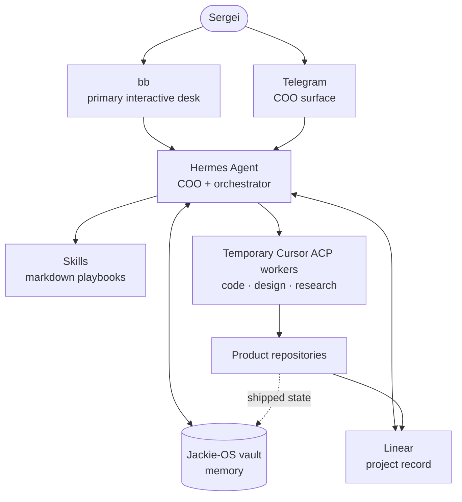

Jackie-OS is the durable operating layer around Sergei's work. The vault holds memory. Skills define repeatable work. Hermes Agent runs the always-on COO loop. bb is the primary interactive desk. Temporary Cursor ACP workers handle bounded delegated tasks. Linear tracks the projects.

## The layers

### 1. Interaction

- **bb** is the primary desk for hands-on work.
- **`@persik_hermes_bot`** is the Telegram surface for briefs, capture, and operations.
- **`@Persik_finbot`** is a separate Newfin finance product bot.

### 2. Durable memory

- **`Vault/`** contains journals, project notes, briefs, decisions, and `hot.md`.
- **Skills** are markdown playbooks. They keep the work portable across models and tools.
- **Git** versions the system and provides an auditable history.

### 3. Always-on loop

Hermes Agent by Nous Research runs the COO loop on the VPS. It handles briefs, journal capture, Read Later, knowledge work, project sync, ops, scheduling, and orchestration.

The model provider is replaceable. The durable system is the vault, the skills, and the operating rules.

### 4. Delegated work

Hermes can dispatch a bounded code, design, or research task to a temporary Cursor ACP worker. A worker gets the repository context and acceptance criteria, does the task in isolation, and returns a result for review.

There is no permanent named worker fleet. The old Buzz/Cyrus fleet was retired on 2026-08-07. The [Fleet Atlas](/fleet) remains as a historical artifact.

### 5. Project tracking

Linear holds the active project record. Git remains the source of truth for code. The Jackie-OS vault remains the source of truth for memory and project context.

## Product boundaries

| Product | Purpose | Jackie-OS connection |
|---|---|---|
| **Newfin** | Personal finance and market context | Separate product and finance bot; project context syncs to the vault |
| **Rodyna** | Family recipes and stories | Separate product repo; project context syncs to the vault |
| **Draw** | Tennis community platform | Separate product repo; project context syncs to the vault |
| **B-Unit** | Habit and quest product | Separate product repo; work is tracked in Linear |

The products do not depend on Jackie-OS at runtime. Jackie-OS connects their project context, operating rhythm, and delegated work.

## Rules that keep the system simple

1. Keep memory in markdown, not in a model session.
2. Keep code in each product repository.
3. Keep active project state in Linear.
4. Use Hermes for the always-on loop.
5. Create temporary workers only when a bounded task needs them.
6. Sync shipped state back into the vault.
