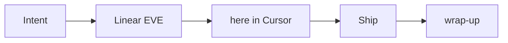

> Generated by System/ops/render-system-match.py. Do not hand-edit.

**Live desk:** Cursor + Tailscale + Hermes VPS + Grokbot.
**Contract:** [Operator desk](/jackie-os/docs/desk).
**Inventory stamp:** 2026-08-17.

Generated. Run System/ops/render-system-match.py after model, inventory, desk, or decisions changes. No new cron.

## Workflow



| Step | What happens |
|---|---|
| Intent | Sergei says build, fix, or change something. |
| Linear EVE | File an issue first. Do not set Sergei as Assignee unless he asks. |
| here in Cursor | Execute in the current Cursor window. One repo per window. |
| Ship | Commit and push, or open a PR. Tag Fixes EVE-… when it applies. |
| wrap-up | Status prepend · brief Log · hot.md · commit + push. |

bb, Buzz, and the Cyrus farm are not the live desk. History: [Desk journey](/jackie-os/docs/desk-journey).

## Tooling

| Tool | Job | Not |
|---|---|---|
| Cursor | Primary interactive desk | Always-on cron brain |
| Tailscale | Mesh: MacBook · Home PC · Hermes · Cloud Agents | Public SSH as the default path |
| Hermes VPS | Briefs, journal, merge-poll, Telegram | Coding worker farm |
| Grokbot | Parallel Grok chat for thinking and drafts | Git or vault truth |
| Linear EVE | Backlog and tracking | Delegate to a cloud factory |
| AgentsView | Spend / session hub on Home PC | The live coding desk |

## Hosts

| Host | Role | Always-on |
|---|---|---|
| MacBook | operator laptop · Cursor + Tailscale (M1 2020) | no |
| Home PC | secondary desk · Cursor / WSL | no |
| Hetzner VPS (Hermes) | always-on briefs/ops · Tailscale hermes-phase1 | yes |

## Subscriptions

| Sub | Used by |
|---|---|
| Gemini free | Newfin STT/media, Rodyna extract, occasional free-tier helpers |
| OpenAI Plus | Hermes Codex primary (gpt-5.6-sol), Newfin /ask+/research Codex path |
| Claude Code subscription | occasional Claude Code on Mac |
| Cursor subscription | Cursor (primary desk), Hermes Grok fallback via copilot-acp |

## Live model chains

Machine-checked in [Hermes runbook](/jackie-os/docs/hermes-runbook). `persiknewfin` matches `default` (no delegation).

```
default=<configured-primary> -> copilot-acp/cursor-grok-4.6-high-fast -> openrouter/openai/gpt-oss-120b -> openrouter/nvidia/nemotron-3-super-120b-a12b:free -> openrouter/nvidia/nemotron-3-ultra-550b-a55b:free -> openrouter/google/gemma-4-26b-a4b-it:free -> openrouter/inclusionai/ling-3.0-flash:free
kawai-coo=openai-codex/gpt-5.6-sol -> openrouter/openai/gpt-oss-120b -> openrouter/nvidia/nemotron-3-super-120b-a12b:free -> openrouter/nvidia/nemotron-3-ultra-550b-a55b:free -> openrouter/google/gemma-4-26b-a4b-it:free -> openrouter/inclusionai/ling-3.0-flash:free
persiknewfin=<configured-primary> -> copilot-acp/cursor-grok-4.6-high-fast -> openrouter/openai/gpt-oss-120b -> openrouter/nvidia/nemotron-3-super-120b-a12b:free -> openrouter/nvidia/nemotron-3-ultra-550b-a55b:free -> openrouter/google/gemma-4-26b-a4b-it:free -> openrouter/inclusionai/ling-3.0-flash:free
```

After `default` changes: `python3 System/ops/hermes-sync-persiknewfin-chain.py` on the VPS, then regenerate this page.

## Personas

Keep these names. They are labels, not a live cloud factory. Hermes is the live ops relay.

| Persona | Role | Lane | Status |
|---|---|---|---|
| Fablio | CEO / CPO / CTO orchestrator | orchestration | kept |
| Cursorio | Fast, spec-driven implementer | implementation | kept |
| Codexio | Design lead and design engineer | design | kept |
| Cyrusio | Delivery engineer, issue to tested PR | delivery | kept |
| Marketio | CMO — strategy, SEO, GTM briefs | marketing | kept |
| Scriptio | Content producer from briefs | content | kept |
| Hermes | Always-on operations relay | ops | live |

## Historical decisions

Newest first. Full ledger: [Decisions](/jackie-os/docs/decisions).

- **2026-08-17 — persiknewfin matches default + living system-match page** — Hermes `persiknewfin` uses the same model chain as `default` (`gpt-5.6-sol` → Cursor Grok 4.6 → GPT-OSS → 4× OpenRouter free). No `delegation` block on the cron profile. After `default` changes, run `System/ops/hermes-sync-persiknewfin-chain.py`. Living system / workflow match page: `docs/workflows/system-match.md` (public `/jackie-os/docs/fleet`), generated from inventory + healthcheck models + decisions-log. Personas stay as labels. No new cron.
- **2026-08-17 — Cursor + Tailscale + Hermes + Grokbot (supersedes bb desk)** — Interactive desk is **Cursor**. Hosts talk over **Tailscale**. Always-on ops stay on **Hermes VPS**. **Grokbot** is a parallel Grok chat surface (thinking / drafting), not git or vault truth. **bb is not in active use.** Contract: [Operator desk](/jackie-os/docs/desk). Supersedes 2026-08-07 "bb desk + System/bb-plugins".
- **2026-08-17 — Merging agent dispatches prod migrations** — After a PR that adds `supabase/migrations/` squash-merges (or is pushed to `main`), the merging agent must immediately `gh workflow run deploy-migrations.yml -f confirm=apply` and watch the run. Do not ask Sergei. Do not convert the workflow to `on: push`. `workflow_dispatch` + `confirm=apply` stay. Hermes VPS autodeploy (`hermes-vps-autodeploy.sh`) remains an additional auto path (`supabase db push`). The human Actions button is no longer the expected path — agents dispatch. Skip only if that workflow file is missing.
- **2026-08-07 — bb desk + System/bb-plugins (supersedes Buzz Mode B)** — Interactive desk is **bb** only. Custom plugins live in `System/bb-plugins/{fleet,linear}`. Cyrus/Buzz farm archived under `System/archive/`. Linear tracks; execution is `here` in bb (Fleet sidebar = Fablio-owned waves, not Delegate). Hermes = briefs/ops. EVE-316.
- **2026-08-05 — Buzz Mode B live fleet (superseded 2026-08-07 → bb)** — **Decision (historical):** Buzz was briefly the live office; Hermes-as-Fablio green-light; nests on Mac. **Superseded** by bb-primary above. Bodies: `System/plans/archive/`.
- **2026-07-30 — Owner Linear signal = input / Ready / merged only** — Agents must not set Sergei as human **Assignee** and must **@mention** him in Linear only for (1) blocking input required, (2) parent Ready / In Review, (3) merged/Done. Telegram `hermes send` stays available for blockers and when he is working via Telegram. Owner push prefs + `Shift+S` unsubscribe after filing live in `OPERATOR.md`. TEAM RULES §18.
- **2026-07-27 — Fablio owns cross-repo kids + migration apply + VPS scripts** — Fablio may (must, when the wave needs it) (1) create Linear kids on the project matching the landing repo even when the parent is elsewhere (e.g. Newfin parent → Jackie OS kids for VPS workers), (2) check statuses / post project updates across those boards, (3) **apply** Newfin/Rodyna DB migrations after merge (`gh workflow run deploy-migrations.yml` and/or verify VPS autodeploy `supabase db push`), (4) run/extend jackie-os `System/scripts` + `System/ops`. Workers still author migration files; Fablio applies unless he delegates an apply kid. TEAM RULES §15 + `_shared/access.md`.
- **2026-07-27 — Host ceiling 6 (Fablio fills toward max)** — Raise **`FLEET_SESSION_CEILING`** default **5 → 6**. Fablio still owns sequencing (fill toward 6 → next-after-Done); Hermes heal/steer still refuse past ceiling / under pressure. Stay on cx23 + 4G swap (prior decision).

## Related

- Desk: [Operator desk](/jackie-os/docs/desk)
- Desk journey: [Desk journey](/jackie-os/docs/desk-journey)
- Inventory: [Architecture](/jackie-os/docs/architecture)
- Hermes models: [Hermes runbook](/jackie-os/docs/hermes-runbook)
- Internal twin: Jackie-OS `docs/workflows/system-match.md`

