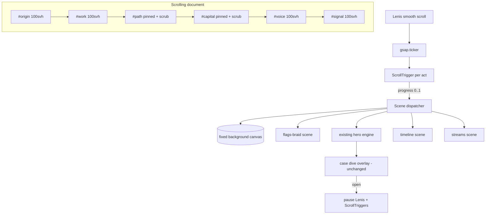

# feat: Cinematic six-act scroll redesign

## Summary

Turn the one-scene site (`site/index.html`) into a six-act, full-viewport cinematic scroll experience: Origin (about) → Work (current chord hero, untouched) → Path (past-work timeline) → Capital (investments) → Voice (writing & appearances) → Signal (contact). Scroll drives pinned, scrubbed transitions between acts; the silk-thread visual identity carries through every act. New scenes extend the existing Canvas 2D engine; scroll orchestration is vendored Lenis + GSAP ScrollTrigger.

## Problem Frame

The site today is a single interactive scene: five silk chords, hover-part, click-dive into case studies. It presents the work but nothing else — no about, no history, no investing surface, no writing index, no contact. The page does not scroll (`body { overflow: hidden }`). The owner wants a top-tier-agency cinematic one-pager where each life surface is a full-screen act and scrolling is the narrative device.

Design direction is locked by the owner's brief (2026-07-13): extend the shipped silk-thread identity ("one thread, many vibrations") — not a reopening of the `docs/2026-07-09-design-directions.md` exploration. The opening image is autobiographical: one thread bundle in Ukrainian-flag colors, one in Vietnamese-flag colors, converging into a single braid — which then splits into the five project chords of the Work act.

---

## Requirements

**Experience**

- R1. The page is a vertically scrolled document of six full-viewport acts, in order: Origin, Work, Path, Capital, Voice, Signal.
- R2. On first load, a time-driven hero animation plays: a Ukrainian-flag-colored thread bundle and a Vietnamese-flag-colored thread bundle enter, weave, and converge; when they merge, the about copy reveals in a stagger.
- R3. Act-to-act transitions are scroll-driven and cinematic (pinned scenes, scrubbed animation), with free scroll + proximity snap — never mandatory scroll-jacking.
- R4. Act 2 preserves the current hero interaction 1:1: hover-parting, chord focus, dive → case view → resurface, keyboard cycling. Its content (`P[]` data) does not change.
- R5. Act 3 renders past work as a scroll-scrubbed timeline: one continuous thread passing through era/industry nodes that bloom into short cards.
- R6. Act 4 renders investing as three streams (angel, markets, real estate) with aggregate stats and owner-approved highlight cards, plus related-essay chips. Categories and aggregates only; no amounts, no names without per-item owner approval.
- R7. Act 5 renders an editorial index of essays, mentions, podcasts, and talks; entries link out.
- R8. Act 6 is a full-screen contact finale: primary CTA (email), social links, and a closing thread signature.
- R9. A persistent minimal nav exposes all six acts as real anchor links (`href="#origin"` … `#signal`) and reflects the active act.

**Technical**

- R10. Zero-build stays: plain static files under `site/`, no npm, no bundler. Third-party libraries are vendored minified files under `site/vendor/`, not CDN links.
- R11. `/jackie-os/*` and `/docs/*` routing (vercel.json) and the `site/jackie-os/` subtree are untouched.
- R12. Performance budget: total JS ≤ 120 KB gzipped (including vendor), LCP ≤ 2.5 s on mid-tier mobile, scenes hold 60 fps desktop / 30 fps floor mobile, offscreen scenes fully paused.
- R13. Works on current-2 versions of Chrome, Safari, Firefox, iOS Safari, Android Chrome. Sections size with `min-height: 100svh`.

**Accessibility & SEO**

- R14. `prefers-reduced-motion: reduce` gets the full degraded contract: no pinning, no parallax, no scrubbed morphs; static thread poses; instant content reveals; plain anchor jumps.
- R15. All acts are keyboard-reachable; nav links are focusable; the act 2 focus/dive keyboard model keeps working inside the scroll document.
- R16. Semantic structure: one `h1` (act 1), `h2` per act, `<section id>` per act, updated `og:` tags. Headings, landmarks, and section skeletons live in the initial HTML; acts 3–5 detail content is JS-rendered — indexed by JS-executing crawlers (Google, Bing), while static crawlers and link previews see the structure plus acts 1–2 copy.

**Content**

- R17. Acts 3–5 are data-driven (JS arrays, same pattern as `P[]`); entries are owner-supplied. The build ships with structure + draft copy; the owner fills/approves content before prod polish is called done.

---

## Key Technical Decisions

- **Scroll orchestration — vendored Lenis + GSAP ScrollTrigger.** GSAP and all plugins are free since April 2025 (Webflow acquisition); this is the proven stack for pinned/scrubbed full-viewport sites. Native CSS scroll-driven animations still lack stable-Firefox support, and a hand-rolled orchestrator re-implements inertia and iOS quirks — the documented time-sink. Wire Lenis with `autoRaf: false` and drive it from `gsap.ticker` (plus `ScrollTrigger.update`) so scroll and animation share one frame.
- **Renderer — extend the existing Canvas 2D engine; no Three.js in this pass.** The brief asks for the projects-section thread style; that style *is* this engine. Reuse gives 1:1 coherence between acts 1 and 2 and keeps zero-build. Three.js is named as the explicit future upgrade path if a later pass wants real depth (supersedes the retired "Three.js 1:1 hero rebuild" idea).
- **One fixed background canvas + scene dispatcher.** A single full-viewport canvas sits behind the document; a dispatcher activates one scene renderer per act (act 1 flags-braid, act 2 existing hero, act 3 timeline thread, act 4 streams, acts 5–6 minimal thread accents) keyed off ScrollTrigger progress. One resize/DPR path (`min(devicePixelRatio, 2)`), one place to pause.
- **Scroll model — free scroll, pinned scrubbed scenes, proximity snap.** Mandatory snap and wheel hijacking are the top UX complaints for this genre (trackpad users especially). Pinning + scrubbing gives the cinema; proximity snap gives the "each act fills the screen" feel without fighting momentum. Snap is ScrollTrigger's `snap` option (fires after momentum settles) — not CSS `scroll-snap`, which conflicts with Lenis inertia.
- **File split — plain static files, no build.** `site/index.html` (markup + critical CSS) + `site/css/site.css` + `site/js/` ES modules (`main.js`, `scenes/*.js`, `data/*.js`) + `site/vendor/`. The single 1072-line file would triple; ES modules served statically keep zero-build while restoring editability. Act 2's engine moves verbatim into `site/js/scenes/work.js`.
- **Act 1 → Act 2 continuity morph, with crossfade fallback.** The merged braid splitting into the five project chords is the signature moment. Primary: scrubbed morph (braid endpoints → five chord anchors). Fallback if the morph fights the untouched-act-2 constraint: a scrubbed crossfade (braid dissolves as chords fade in) — decided during U3, not later.
- **Reduced motion via `gsap.matchMedia`.** One media-query boundary creates/destroys all ScrollTriggers; the reduced branch installs the static contract (R14). The existing `prefers-reduced-motion` CSS block stays.
- **Fonts gate the reveal.** `font-display: swap` + `<link rel="preload">` + Font Loading API: the act 1 text reveal starts only after fonts resolve, so the signature moment never renders in fallback type.
- **Flag palettes as accents, not fills.** UA `#005BBB/#FFD500` and VN `#DA251D/#FFFF00` render as filament gradient accents with the site's existing nebula-glow treatment over `--space #0C0E16` — desaturated/glowed to sit in the palette, not as literal flag blocks.
- **Privacy by process, not by flag.** `site/js/data/capital.js` is world-readable source; a render-time "approved" flag would still ship unapproved names in the file. So the data file only ever contains owner-approved content: no amounts field exists in the schema, and a named entry is committed only after explicit owner approval (U9). No unapproved state exists in the repo.

---

## High-Level Technical Design

**Act choreography** (each act: entry transition → resident state → exit transition):

1. **Origin.** Load (time-driven, ~2.4 s): UA bundle enters from upper left, VN bundle from lower right, using the existing filament sway physics; they braid at center; on merge the about copy staggers in (name → "generalist, two cultures" line → background chips). Resident: braid breathes; subtle pointer parallax. Exit (scroll-scrubbed): braid splits into five strands that become act 2's chord anchors (KTD morph/fallback).
2. **Work.** Existing scene, pinned one viewport. Entry: chords settle from the act 1 handoff. Resident: fully interactive as today; dive/case/resurface unchanged; while a case is open, Lenis and ScrollTriggers pause (case has its own scroll). Exit: chords recede into depth, glimpse fades.
3. **Path.** Pinned ~2 viewports of scroll distance. One gold thread runs left→right; scrubbing advances a horizontal camera along era nodes (education → industries → ventures); each node blooms a small card (role, years, one line, industry tag). Node count and copy from `site/js/data/path.js`.
4. **Capital.** Pinned ~1.5 viewports. The thread splits into three colored streams — angel / markets / real estate; each stream heads a column with count-up aggregates (e.g. "N angel checks · thesis line") and 0–2 highlight cards; essay chips link into act 5. Data from `site/js/data/capital.js`.
5. **Voice.** Free-scrolling editorial index (canvas rests as a thin horizon thread): large serif rows — essays, mentions, podcasts, talks — with type, year, source, external link; hover draws a thread underline. Data from `site/js/data/voice.js`.
6. **Signal.** Full-screen finale: the horizon thread ties into a small knot/signature glyph above a single large CTA (email), social links, and a one-line closing. Footer microcopy.

---

## Implementation Units

### U1. Scroll architecture scaffold

- **Goal:** The page becomes a six-section scrolling document with vendored Lenis + GSAP wired, a scene dispatcher on one fixed canvas, proximity snap, and the reduced-motion boundary — with placeholder scenes.
- **Requirements:** R1, R3, R9, R10, R12, R13, R14 (skeleton), R16 (skeleton)
- **Dependencies:** none
- **Files:** `site/index.html`, `site/css/site.css`, `site/js/main.js`, `site/js/scroll.js`, `site/js/dispatcher.js`, `site/vendor/lenis.min.js`, `site/vendor/gsap.min.js`, `site/vendor/ScrollTrigger.min.js`
- **Approach:** Remove `body { overflow: hidden }`; introduce six semantic `<section>`s (`min-height: 100svh`) and the fixed background canvas. Wire Lenis `autoRaf:false` → `gsap.ticker` → `ScrollTrigger.update`. Dispatcher maps act ↔ scene renderer, driven by each act's ScrollTrigger `onUpdate(progress)`, and owns scene lifecycle: scenes mount on approach, unmount on exit, and cancel their rAF/intervals on unmount — only the active (and adjacent, for handoffs) scene ticks. Act data ships as static ES-module exports (`site/js/data/*.js`), never fetched. `gsap.matchMedia` splits full-motion vs reduced branches. Nav with real anchors + active-act state.
- **Patterns to follow:** existing DPR cap and resize handling (`site/index.html` canvas fit, current lines ~510–516); existing IntersectionObserver pause pattern (~748–752).
- **Test scenarios:** scrolling top→bottom passes six full-screen acts in order (desktop + iOS Safari); trackpad free-scroll never fights momentum, proximity snap settles near act boundaries; with `prefers-reduced-motion: reduce`, no pinning occurs and anchors jump instantly; `#capital` anchor loads scrolled to act 4; JS disabled still shows readable section text.
- **Verification:** all acts reachable by scroll, keyboard nav, and anchor links on the three engines; vendor payload within R12 budget (check gzip sizes).

### U2. Act 2 — existing hero embedded as the Work scene

- **Goal:** The current chord hero + dive/case flow lives at act 2 with interaction parity, inside the scroll document.
- **Requirements:** R4, R15
- **Dependencies:** U1
- **Files:** `site/js/scenes/work.js` (engine moved verbatim), `site/index.html` (case DOM stays), `site/css/site.css`
- **Approach:** Move `createHero` + case flow into the scene module with four defined seams (everything else verbatim): (a) dispatcher contract — the scene exposes `mount`/`unmount`/`tick(progress)`; ScrollTrigger owns act 2 pinning, and the engine's own `pinHero`/`unpinHero` calls (with their spacer div) are removed from `casePrep`/`resurface`. (b) Case-open pauses scroll concretely: `lenis.stop()` + disable act ScrollTriggers on dive, restore on resurface; `#case` keeps its own `overflow-y` scroll; case-open pushes a history state so browser Back closes the case. (c) Residency defined: pointer handlers gate on scroll position within act 2 bounds; key handlers (arrows/Enter) act only while the hero canvas has focus (`#hero` keeps `tabindex=0`), so arrows never carry double meaning with page scroll. (d) Touch: tap handlers are suppressed while a scroll gesture is in flight (Lenis velocity check), so tap-to-focus never fires mid-scroll. Reduced motion: act 2 is not pinned — a normal flowing section with the existing static center-chord pose (`focusAmt = [.05,.05,1,.05,.05]`); dive opens the case instantly, as today. The `#case` overlay, flying icon, and memory-viz stay as-is.
- **Patterns to follow:** the engine's case flow (`pinHero` ~844–852, `unpinHero` ~853–858, `casePrep` ~859–881, `resurface` ~882–900; dispatcher setup ~757–843) — self-pinning replaced by the dispatcher contract above.
- **Test scenarios:** hover parts threads exactly as production today; Enter dives, case scrolls, Esc/resurface returns to act 2 at the same scroll position; browser Back with a case open closes the case instead of leaving the page; wheel inside an open case never moves the underlying document; arrow-key chord cycling works when the hero canvas has focus and does nothing otherwise; a tap during scroll momentum does not focus or dive; reduced-motion: act 2 unpinned, static center-chord pose, instant case open.
- **Verification:** side-by-side behavioral diff against production URL; no console errors through five dive/resurface cycles.

### U3. Act 1 — dual-heritage hero and the handoff morph

- **Goal:** The signature opening: flag-colored bundles converge → about copy reveals → scroll splits the braid into act 2's chords.
- **Requirements:** R2, R14, R16 (h1 lives here)
- **Dependencies:** U1 (U2 for the handoff targets)
- **Files:** `site/js/scenes/origin.js`, `site/js/data/about.js`, `site/index.html`, `site/css/site.css`
- **Approach:** Build the bundles from the existing filament physics (independent sway phases) with UA/VN gradient accents per the palette KTD. Load animation is time-driven; completion gates on `document.fonts` so the text reveal is in final type. About copy: name, generalist/two-cultures line (existing site copy is the seed: "Vietnamese-Ukrainian, born in Odesa, raised between two languages"), 3–4 background chips. Exit ScrollTrigger scrubs the braid-→-five-chords morph; decide morph vs crossfade fallback here (KTD).
- **Patterns to follow:** filament loop (current lines ~665–699), dive state machine's eased three-act structure (~593–610), `drawCoreSphereG` for merge-point glow.
- **Test scenarios:** cold load on throttled mid-tier mobile plays the converge animation without layout shift and LCP within R12; reload mid-page (`#voice`) does not force-play the intro, and scrolling back up finds act 1 in its merged resting state; reduced-motion shows the merged braid + copy instantly and scrolling past act 1 cuts to act 2's static chords with no morph or crossfade; slow font load delays only the text reveal, not the threads; scrolling during the intro gracefully fast-forwards it.
- **Verification:** recorded 60 fps capture of load + handoff reviewed against the design intent; act 1→2 morph reads as one continuous thread system.

### U4. Act 3 — Path timeline scene

- **Goal:** Scroll-scrubbed past-work timeline: one thread through industry/era nodes with bloom cards.
- **Requirements:** R5, R17
- **Dependencies:** U1
- **Files:** `site/js/scenes/path.js`, `site/js/data/path.js`, `site/css/site.css`
- **Approach:** Pinned section, ~2 viewports of scrub distance; thread polyline + camera translate driven by progress; nodes bloom (scale/alpha) as they cross center; cards are DOM (positioned over canvas) for selectable text. Data model: `{era, role, org?, industry, line, years}`. Ship with structured draft entries flagged for owner fill (R17).
- **Patterns to follow:** glimpse positioning pattern for DOM-over-canvas anchoring (current ~790); node bloom easing from `smooth()`.
- **Test scenarios:** scrubbing forward/back replays node blooms deterministically; tab focuses each visible card; reduced-motion renders the full timeline statically (all nodes visible, vertical list on mobile); 8+ nodes hold 60 fps desktop.
- **Verification:** timeline readable end-to-end on 375 px viewport; content parity with `data/path.js`.

### U5. Act 4 — Capital streams scene

- **Goal:** Investing surface: three thread streams into aggregate columns with highlights and essay chips.
- **Requirements:** R6, R17
- **Dependencies:** U1 (visual continuity with U4's thread exit)
- **Files:** `site/js/scenes/capital.js`, `site/js/data/capital.js`, `site/css/site.css`
- **Approach:** Pinned ~1.5 viewports: single thread trifurcates into three colored streams; each column header + count-up aggregates (tick from 0 on entry, once) + up to 2 highlight cards + essay chips (anchor into `#voice` entries). Privacy per the process KTD: the schema has no amount field, and `capital.js` only ever contains owner-approved entries — approval happens before commit, never as a render-time flag.
- **Patterns to follow:** stream drawing from filament loop; count-up eased with `smooth()`; chips reuse `.statechips` styling (current case CSS).
- **Test scenarios:** count-ups run once per page visit, not per re-entry; the committed `capital.js` contains no amounts and no names beyond the owner-approved list (review-time check); essay chip scrolls to the matching `#voice` row; reduced-motion shows final numbers immediately, streams static.
- **Verification:** column layout holds at 320 px; repo/site source contains zero unapproved names or amounts.

### U6. Acts 5 & 6 — Voice index and Signal finale

- **Goal:** Editorial writing/appearances index and the full-screen contact close.
- **Requirements:** R7, R8, R17
- **Dependencies:** U1
- **Files:** `site/js/scenes/voice.js`, `site/js/data/voice.js`, `site/index.html`, `site/css/site.css`
- **Approach:** Voice: free-scrolling section (no pin), canvas thread rests as a horizon line; rows `{type: essay|mention|podcast|talk, title, source, year, url}` in large serif with hover thread-underline; type filter chips optional-out (YAGNI unless >12 entries). Signal: knot/signature glyph drawn once (reuse `circlePts`), `mailto:` CTA, social links, closing line.
- **Patterns to follow:** About/Writing overlay typography (current ~310–330) seeds the serif treatment; existing `.ovl` content becomes Voice/Origin content and the overlays are retired.
- **Test scenarios:** every row is a real `<a>` (crawlable, middle-clickable); empty `voice.js` renders the section with a graceful "writing lives here soon" state, not a blank screen; contact CTA focus ring visible; knot renders identically on DPR 1 and 2.
- **Verification:** Lighthouse a11y pass on both sections; links resolve.

### U7. Accessibility, SEO, and semantics pass

- **Goal:** The full R14–R16 contract holds across the six acts.
- **Requirements:** R14, R15, R16
- **Dependencies:** U1–U6
- **Files:** `site/index.html`, `site/css/site.css`, `site/js/scroll.js`
- **Approach:** Audit pass, not a rebuild: heading order, landmark roles, focus order act-by-act, skip-to-content link, reduced-motion walkthrough of every act, `og:`/description refresh, per-act `aria-label`s. Verify act 2's existing aria/keyboard model survived U2.
- **Test scenarios:** VoiceOver reads acts in order with meaningful labels; keyboard-only user can reach every card, row, and CTA; reduced-motion user sees all content of all six acts with zero pinned scenes; browser back/forward traverses anchor history sanely and never strands scroll mid-pin; `og:image`/title render correctly in a link preview.
- **Verification:** Lighthouse a11y ≥ 95; manual VoiceOver + keyboard sweep logged in the PR.

### U8. Performance pass and ship gate

- **Goal:** R12 budget proven on real devices; scenes pause correctly; the page feels agency-grade, not heavy.
- **Requirements:** R12, R13
- **Dependencies:** U1–U7
- **Files:** touched files as needed; no new surface
- **Approach:** Run `jos-performance-check` against the live preview: LCP/CLS/INP, scene fps traces, vendor payload audit, canvas pause verification (only active scene ticking), font preload check. Fix highest-impact issues one at a time, re-measure.
- **Test scenarios:** background tab CPU near zero; rapid full-page scroll never drops below 30 fps on a mid-tier Android; Vercel preview LCP ≤ 2.5 s on throttled 4G; total transferred JS ≤ 120 KB gzip.
- **Verification:** performance-check report attached to the PR; budgets met or consciously re-negotiated in the plan.

### U9. Content fill and polish (owner + design critique)

- **Goal:** Real content in acts 3–5, copy polish, and the visual quality bar signed off.
- **Requirements:** R17, R2 (final copy), R6 (approvals)
- **Dependencies:** U3–U6
- **Files:** `site/js/data/path.js`, `site/js/data/capital.js`, `site/js/data/voice.js`, `site/js/data/about.js`
- **Approach:** Owner supplies: past-work entries, investment aggregates + approved highlights, writing/appearance list, final about copy. Then a `jos-design-ui` critique pass (screenshot-verified, criterion-resolved) across all six acts on desktop + mobile; iterate until the agency bar is met.
- **Test scenarios:** Test expectation: none — content and visual-QA unit; the gate is the critique table and owner sign-off.
- **Verification:** owner approves each act's content; critique findings closed.

---

## Scope Boundaries

**In:** everything under `site/` for the main page; vendoring; the six acts; content data models.

**Untouched:** `site/jackie-os/` (Fumadocs output) and `docs-src/`; `vercel.json` routes; case-study content (`P[]`); the dive/case interaction design.

**Deferred to follow-up work:**
- Three.js/WebGL upgrade of any scene (explicit future path; replaces the retired "Three.js 1:1 hero rebuild" backlog idea).
- Real product screenshots in case frames (existing backlog EVE-78) — slots into act 2/3 later.
- Custom domain (EVE-80) — orthogonal.
- Per-act dynamic `og:` tags / social cards per section; a static refresh ships in U7.
- Writing filter chips if the Voice list is short (<12 entries).

**Outside identity:** blog/CMS, analytics suites, frameworks (React etc.) — the site stays hand-built static.

---

## Risks & Dependencies

- **Scroll-feel risk (highest UX risk).** Pinned scenes + snap can read as scroll-jacking to trackpad users. Mitigation is baked into KTDs (free scroll, proximity snap, reduced-motion opt-out); U8 includes a real-device feel pass. If it still feels controlling, drop snap first, keep pins.
- **Act 2 regression risk.** The engine move (U2) touches the site's proven core. Mitigation: verbatim move + dispatcher shims only; behavioral diff against production before merging U2.
- **iOS toolbar resize churn.** `100svh` + Lenis handles the common case; U8 tests on real iOS. Fallback: freeze section heights at load on iOS.
- **Single-page weight growth.** Six scenes + vendor in one page; budget enforced at U8; scenes lazy-init on first approach.
- **Content dependency (schedule risk, not technical).** Acts 3–5 need owner content (U9); structure ships with drafts so the build never blocks on copy.
- **Morph complexity (U3).** The braid→chords handoff may fight the untouched-act-2 constraint; fallback (crossfade) is pre-decided so U3 cannot stall.

---

## Acceptance Examples

- AE1. **Given** a first-time visitor on desktop Chrome, **when** the page loads, **then** the two flag-colored bundles converge within ~2.5 s and the about copy staggers in — with no font swap flash and no layout shift.
- AE2. **Given** the visitor scrolls from act 1 to act 2, **when** the transition scrubs, **then** the merged braid visually becomes the five project chords (or crossfades per fallback) and act 2 behaves exactly like today's production hero, including dive and resurface.
- AE3. **Given** `prefers-reduced-motion: reduce`, **when** the visitor traverses the page, **then** no section pins, all content is visible statically, and anchor links jump instantly.
- AE4. **Given** a phone in portrait with the browser toolbar visible, **when** each act is entered, **then** the act fills the visible viewport without clipped CTAs or dead space.
- AE5. **Given** the world-readable `site/js/data/capital.js`, **when** act 4 ships, **then** the file contains no dollar amounts and only owner-approved names — approval gates the commit, not the render.

---

## Sources & Research

- `site/index.html` — engine internals: filament physics (~665–699), dive state machine (~593–610), shared primitives `drawCoreSphereG`/`circlePts` (~445–505), reduced-motion blocks (~240–243, ~741–743), case flow (`pinHero`/`casePrep`/`resurface` ~844–900; dispatcher setup ~757–843). Page is currently non-scrolling (`body{overflow:hidden}`).
- `docs/2026-07-09-design-directions.md` — prior direction exploration (D1–D15); this plan extends the shipped silk direction rather than reopening it.
- `plans/future-improvements.md` — v1 "no animation frameworks" rule, superseded per-act by this plan (act 2 stays Canvas 2D baseline; catalog updated alongside this plan).
- GSAP ScrollTrigger docs (pin/scrub/snap; `gsap.matchMedia`) — gsap.com/docs/v3/Plugins/ScrollTrigger; GSAP free since 2025: webflow.com/blog/gsap-becomes-free.
- Lenis (`autoRaf:false` + `gsap.ticker` wiring) — github.com/darkroomengineering/lenis.
- CSS scroll-driven animations support (mid-2026: no stable Firefox) — MDN Scroll-driven animations guide; grounds the GSAP choice.
- Scroll-jacking UX evidence (NN/g-cited disorientation findings; trackpad failure case) — webdesignerdepot.com "How Scrolljacking Breaks UX Fundamentals".
- Viewport units (`svh`/`dvh`), canvas performance (DPR cap, pause offscreen, batch), font loading (`font-display: swap` + preload + Font Loading API) — web.dev/MDN guides.

---

## Open Questions

- Final about copy and background chips (owner voice) — U9.
- Past-work timeline entries, investment aggregates + approved highlights, and the writing/appearances list — U9 content dependency.
- Whether the nav shows act names or numerals (I–VI) — decide in the U1 design pass with `jos-design-ui`.
