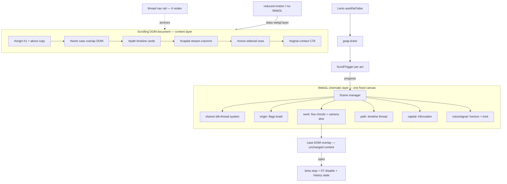

# feat: Cinematic six-act scroll redesign

## Summary

Rebuild the site (`site/`) as a six-act, full-viewport cinematic scroll experience rendered in **Three.js/WebGL**: Origin (about) → Work (the five-chord projects scene, ported with interaction parity) → Path (past-work timeline) → Capital (investments) → Voice (writing & appearances) → Signal (contact). Scroll drives pinned, scrubbed 3D transitions; one silk-thread system carries the identity through every act. Content is DOM-first (WebGL is the cinematic layer, not the content), so the page loads fast and degrades cleanly. Scroll orchestration is vendored Lenis + GSAP ScrollTrigger. *(Revised 2026-07-14, owner call: full Three.js migration replaces the earlier Canvas-2D-only pass.)*

## Problem Frame

The site today is a single interactive Canvas 2D scene: five silk chords, hover-part, click-dive into case studies. It presents the work but nothing else — no about, no history, no investing surface, no writing index, no contact — and the page does not scroll. The owner wants a top-tier-agency cinematic one-pager: each life surface a full-screen act, scrolling as the narrative device, true 3D material and depth (silk sheen, camera moves), clean typography — while staying lightweight enough to load fast.

Design direction is locked by the owner's brief: extend the silk-thread identity ("one thread, many vibrations"). The opening image is autobiographical — one thread bundle in Ukrainian-flag colors, one in Vietnamese-flag colors, converging into a single braid, which then splits into the five project chords of the Work act.

---

## Requirements

**Experience**

- R1. The page is a vertically scrolled document of six full-viewport acts, in order: Origin, Work, Path, Capital, Voice, Signal.
- R2. On first load, a time-driven hero animation plays: a Ukrainian-flag-colored thread bundle and a Vietnamese-flag-colored thread bundle enter, weave, and converge; when they merge, the about copy reveals in a stagger.
- R3. Act-to-act transitions are scroll-driven and cinematic (pinned scenes, scrubbed camera + shader animation), with free scroll + proximity snap — never mandatory scroll-jacking.
- R4. Act 2 preserves the current hero's interaction design 1:1 — hover-parting, chord focus, dive → case view → resurface, keyboard cycling — re-rendered in Three.js; the dive becomes a camera fly-through. Case content (`P[]` data, case DOM overlay) does not change.
- R5. Act 3 renders past work as a scroll-scrubbed timeline: one continuous thread passing through era/industry nodes that bloom into short cards.
- R6. Act 4 renders investing as three streams (angel, markets, real estate) with aggregate stats and owner-approved highlight cards, plus related-essay chips. Categories and aggregates only; no amounts, no names without per-item owner approval.
- R7. Act 5 renders an editorial index of essays, mentions, podcasts, and talks; entries link out.
- R8. Act 6 is a full-screen contact finale: primary CTA (email), social links, and a closing thread signature.
- R9. Persistent navigation: a fixed thread-styled rail with six nodes (act numerals + names on hover/focus) plus a top wordmark; nodes are real anchor links (`href="#origin"` … `#signal`), reflect the active act, and are keyboard-focusable. Deep links land on the right act.

**Technical**

- R10. Zero-build stays: plain static files under `site/`, ES modules + import map, no npm/bundler. Three.js, GSAP ScrollTrigger, and Lenis are vendored minified files under `site/vendor/` with pinned versions recorded.
- R11. `/jackie-os/*` and `/docs/*` routing (vercel.json) and the `site/jackie-os/` subtree are untouched.
- R12. Lightweight-first loading: initial HTML/CSS paints the act structure and hero heading immediately (LCP is text, ≤ 2.0 s desktop / 2.5 s mid-tier mobile); Three.js loads async and fades the cinematic layer in when ready. Total JS ≤ 220 KB gzipped (three ≈ 150, gsap+lenis ≈ 30, app ≈ 40). Scenes hold 60 fps desktop / 30 fps floor mobile; offscreen scenes fully paused; quality tiers (DPR cap, filament count, post-processing off) degrade on weak GPUs.
- R13. Works on current-2 versions of Chrome, Safari, Firefox, iOS Safari, Android Chrome. Sections size with `min-height: 100svh`. WebGL context loss is handled (rebuild or fall back per R14).
- R14. Progressive enhancement: all content lives in the DOM and the page is fully readable and navigable with WebGL unavailable, JS partially failed, or `prefers-reduced-motion: reduce` — a clean editorial page with static styling, no pinning, instant anchor jumps.

**Accessibility & SEO**

- R15. All acts keyboard-reachable; nav rail focusable; act 2's key model (arrows/Enter while its canvas region has focus) works inside the scroll document without hijacking page scroll.
- R16. Semantic structure: one `h1` (act 1), `h2` per act, `<section id>` per act, updated `og:` tags. Headings, landmarks, and acts 1–2 copy live in the initial HTML; acts 3–5 detail content is DOM rendered from data modules (indexed by JS-executing crawlers; static crawlers see structure + acts 1–2).
- R17. Clean typography: a deliberate display/text pairing with a defined scale, preloaded woff2, `font-display: swap`; the act 1 reveal gates on the Font Loading API so the signature moment renders in final type.

**Content**

- R18. Acts 3–5 are data-driven (`site/js/data/*.js` static ES-module exports); first version filled from safe, non-private Jackie-OS vault material (professional facts only) with placeholders where the vault has nothing public-ready; everything marked for owner review.

---

## Key Technical Decisions

- **Renderer — Three.js everywhere (full migration).** One WebGL renderer, one fixed full-viewport canvas, one scene graph per act. This buys the agency-tier gap Canvas 2D can't close: anisotropic silk sheen on ribbon geometry, real perspective depth, camera-driven transitions, bloom/DOF post. Act 2 is a **port, not a redesign**: same five chords, same interaction contract, new materials + camera dive. The Canvas 2D engine retires with git history as reference.
- **Shared thread system before any scene.** One instanced silk-ribbon system (curve → ribbon geometry, sheen material, per-filament sway in the vertex shader, braid/converge/split utilities, palette accents) is the core asset every act reuses. Scenes compose it; nobody re-implements threads.
- **DOM-first content, WebGL as the cinematic layer.** Copy, cards, lists, and CTAs are real DOM positioned over the canvas; the 3D layer renders threads, atmosphere, and transitions. This is what makes R12 (fast first paint), R14 (fallback), R16 (indexability), and text selection all true at once.
- **Scroll orchestration — vendored Lenis + GSAP ScrollTrigger.** Free since 2025, canonical for pinned/scrubbed sites. Lenis `autoRaf:false`, driven from `gsap.ticker`, `ScrollTrigger.update` on tick; scene `tick(progress)` fed from each act's ScrollTrigger. Snap is ScrollTrigger's `snap` (fires after momentum settles) — never CSS `scroll-snap` (conflicts with Lenis inertia).
- **Async boot, no blocking.** `<script type="module">` + import map; three loads after first paint; until scene-ready the page shows the styled DOM (and a subtle static thread SVG accent in act 1) — then the cinematic layer cross-fades in. No loader screens.
- **Scroll model — free scroll, pinned scrubbed scenes, proximity snap.** Mandatory snap and wheel hijacking are this genre's top UX complaints (trackpad especially). Pinning + scrubbing gives the cinema; proximity snap gives "each act fills the screen" without fighting momentum.
- **Reduced motion + no-WebGL share one fallback path** via `gsap.matchMedia` + a WebGL capability check: no canvas, no pinning, static editorial layout, instant jumps. One code path, tested once (R14).
- **Quality tiers.** Boot-time GPU probe (extensions, DPR, `deviceMemory` hint) selects tier: full (post-processing on), medium (no post, DPR ≤ 1.5), low (reduced filament counts) — decided once, not adaptive mid-session.
- **Flag palettes as accents, not fills.** UA `#005BBB/#FFD500`, VN `#DA251D/#FFFF00` as filament gradient accents under the site's nebula-glow treatment over `--space #0C0E16` — desaturated to sit in the palette, never literal flag blocks.
- **Privacy by process, not by flag.** `site/js/data/capital.js` is world-readable source; it only ever contains owner-approved content — no amounts field exists in the schema, and a named entry is committed only after explicit owner approval. No unapproved state exists in the repo. Vault-harvested content follows the same gate: professional/public-safe facts only, nothing `#private`.
- **Typography system.** Display serif for act headings + clean sans/serif text pairing (final faces picked in the design pass), fluid scale via `clamp()`, tracked in CSS tokens; woff2 preloaded (R17).

---

## High-Level Technical Design

**Act choreography** (entry → resident → exit; camera is the narrator):

1. **Origin.** Load (time-driven ≈ 2.4 s, gated on fonts): UA bundle enters upper-left, VN bundle lower-right, weaving with shader sway; camera drifts in slowly; on merge, a soft bloom pulse and the about copy staggers in (name → generalist/two-cultures line → background chips). Resident: braid breathes, subtle pointer parallax on camera. Exit (scrubbed): camera pulls back as the braid splits into five strands that land on act 2's chord anchors.
2. **Work.** Pinned one viewport. The five chords in depth, hover-parting via raycast-driven repulsion — interaction parity with production. Dive = camera fly-through (dolly + FOV bloom) into the chord, then the existing case DOM overlay rises; while open, Lenis + ScrollTriggers pause and a history state is pushed (Back closes). Resurface reverses the camera. Exit: chords recede into fog.
3. **Path.** Pinned ~2 viewports. One gold thread runs into depth; scrub advances the camera along it through era nodes (education → industries → ventures); each node blooms a DOM card anchored to its projected position. Data from `site/js/data/path.js`.
4. **Capital.** Pinned ~1.5 viewports. The thread trifurcates into three colored streams — angel / markets / real estate — each heading a DOM column with count-up aggregates and 0–2 highlight cards; essay chips anchor into `#voice`. Data from `site/js/data/capital.js`.
5. **Voice.** Free-scrolling; the thread rests as a thin horizon line behind large serif editorial rows — essays, mentions, podcasts, talks (type, year, source, external link); hover draws a thread underline. Data from `site/js/data/voice.js`.
6. **Signal.** Full-screen finale: the horizon thread ties into a slowly rotating knot/signature glyph; primary `mailto:` CTA, social links, one-line close.

---

## Implementation Units

Execution order: U1 → U10 → (U3 ∥ U2 ∥ U4 ∥ U5 ∥ U6) → U7 ∥ U8 → U9.

### U1. Scaffold — document, nav, scroll core, renderer boot

- **Goal:** Six-section DOM document with thread nav rail, vendored three/gsap/lenis wired, WebGL renderer core booting async, stub scenes rendering placeholders end-to-end, reduced-motion/no-WebGL fallback path working.
- **Requirements:** R1, R3, R9, R10, R12 (skeleton), R13, R14, R16 (skeleton), R17 (tokens)
- **Dependencies:** none
- **Files:** `site/index.html`, `site/css/site.css`, `site/js/main.js`, `site/js/scroll.js`, `site/js/stage.js` (renderer + scene manager + quality tiers), `site/js/scenes/*.js` (stubs), `site/vendor/three.module.min.js`, `site/vendor/gsap.min.js`, `site/vendor/ScrollTrigger.min.js`, `site/vendor/lenis.min.js`, `site/vendor/VERSIONS.md`
- **Approach:** Replace the fixed non-scrolling body with a flowing document (`min-height:100svh` sections); carry existing about/writing overlay copy into acts 1/5 DOM; keep `#case` overlay markup for act 2. Import map + async module boot; content paints before three loads; capability check routes to fallback. Scene manager owns lifecycle (mount on approach / unmount + rAF cancel on exit; only active + adjacent tick). Lenis→ticker→ScrollTrigger wiring; proximity snap via ScrollTrigger. Nav rail with anchors + active state. Type tokens + font preload.
- **Test scenarios:** all six acts reachable by scroll/anchors/keyboard on the three engines; first paint shows styled content before three finishes loading (throttled network check); WebGL disabled → clean editorial page, zero console errors; reduced-motion → no pinning, instant jumps; vendor gzip total within R12.
- **Verification:** page runs end-to-end with placeholder scenes; budgets measured and recorded.

### U10. Shared silk-thread system

- **Goal:** The reusable 3D asset: instanced ribbon threads with sheen material, shader sway, and braid/converge/split/trifurcate utilities — demo scene proving the look.
- **Requirements:** R2/R4/R5/R6 (enabling), R12 (perf)
- **Dependencies:** U1
- **Files:** `site/js/three/threads.js`, `site/js/three/materials.js`, `site/js/three/curves.js`
- **Approach:** Curve-driven ribbon geometry (instanced or merged strips per bundle), custom ShaderMaterial: anisotropic sheen along the fiber, per-filament phase sway in the vertex shader (port the 2D engine's independent-sway feel), additive glow pass on the full tier. Utilities take control points + palette and return animatable thread bundles with a single `progress`-style uniform for morphs (braid→split is one interpolation).
- **Patterns to follow:** the retired engine's filament phase math (`site/index.html` git history ~665–699) as the motion reference — the *feel* must survive the port.
- **Test scenarios:** demo scene at 60 fps desktop / 30 fps mid-mobile with full act-1 filament counts; sheen visibly travels when the camera orbits; low tier renders acceptably without post; no shader compile errors on ANGLE/Metal/GL (Chrome/Safari/Firefox smoke).
- **Verification:** side-by-side capture vs the old Canvas hero — motion character recognizably the same family, material clearly richer.

### U2. Act 2 — Work scene port (chords + camera dive)

- **Goal:** The five-chord scene in Three.js with interaction parity, camera-dive into the unchanged case DOM overlay.
- **Requirements:** R4, R15
- **Dependencies:** U10
- **Files:** `site/js/scenes/work.js`, `site/index.html` (case DOM stays), `site/css/site.css`
- **Approach:** Five chord bundles from the thread system with per-project palettes; raycast plane → proximity repulsion (hover-part), focus states, glimpse DOM element re-anchored to projected chord positions. Keys (arrows/Enter) active only while the act-2 canvas region has focus (`tabindex=0` wrapper); pointer gates on act-2 scroll bounds; taps suppressed while Lenis velocity is nonzero. Dive: camera dolly+FOV ease into the chord (three eased acts, matching the old bloom→warp→arrive timing), then case overlay rises; `lenis.stop()` + ST disable + history state on open, restored on close/Back. Reduced motion: unpinned static center-focus render or fallback DOM list per R14 path.
- **Patterns to follow:** old dive state machine timing (git history ~593–610); case flow contract from the v1 plan (pin/unpin owned by ScrollTrigger, no spacer div).
- **Test scenarios:** hover parts threads with production-equivalent feel; Enter dives, case scrolls, Esc/Back/resurface all return to act 2 at the same scroll position; wheel in open case never moves the document; arrows cycle only with canvas focus; tap during momentum does nothing; five dive/resurface cycles leak no geometry (memory profile flat).
- **Verification:** behavioral checklist against production URL, item by item.

### U3. Act 1 — Origin scene (dual-heritage braid + reveal + handoff)

- **Goal:** The signature opening and the braid→five-chords scrubbed handoff into act 2.
- **Requirements:** R2, R14, R16 (h1), R17
- **Dependencies:** U10 (U2 for handoff anchors)
- **Files:** `site/js/scenes/origin.js`, `site/js/data/about.js`, `site/index.html`, `site/css/site.css`
- **Approach:** Two thread bundles (UA/VN accent palettes) converge via the braid utility; camera drift-in; merge triggers bloom pulse + DOM copy stagger (gated on `document.fonts`). Exit ScrollTrigger scrubs split-to-chord-anchors with camera pullback. Scrolling mid-intro fast-forwards it; returning to top shows the merged resting state (intro plays once per load). Reduced motion: static merged pose, copy visible, no morph — cut to act 2's static pose.
- **Test scenarios:** cold load mobile: text LCP within R12 before three finishes; intro plays once, no layout shift; slow font delays only the text reveal; scrub down-up-down replays the handoff deterministically; reduced-motion instant.
- **Verification:** captured load + handoff reviewed at 60 fps; the act1→act2 thread continuity reads as one system.

### U4. Act 3 — Path timeline scene

- **Goal:** Scroll-scrubbed 3D timeline: camera travels a thread through era nodes with DOM cards.
- **Requirements:** R5, R18
- **Dependencies:** U10
- **Files:** `site/js/scenes/path.js`, `site/js/data/path.js`, `site/css/site.css`
- **Approach:** Thread curve into depth; camera lerps along it by progress; nodes (small glow spheres on the thread) bloom DOM cards anchored via `project()` as they near the camera. Data `{era, role, org?, industry, line, years}`. Reduced motion/fallback: vertical DOM list.
- **Test scenarios:** scrub forward/back deterministic; cards keep readable contrast over the scene; 8+ nodes at 60 fps desktop; 375 px viewport readable; tab reaches visible cards.
- **Verification:** end-to-end read-through matches `data/path.js` exactly.

### U5. Act 4 — Capital streams scene

- **Goal:** Thread trifurcation into three stream columns with aggregates, highlights, essay chips.
- **Requirements:** R6, R18
- **Dependencies:** U10 (U4 exit continuity)
- **Files:** `site/js/scenes/capital.js`, `site/js/data/capital.js`, `site/css/site.css`
- **Approach:** Trifurcate utility; three accent palettes; DOM columns with count-up aggregates (once per visit), highlight cards, essay chips anchoring into `#voice`. Privacy per KTD — the data file contains only approved content, no amounts field.
- **Test scenarios:** count-ups fire once; committed `capital.js` has no amounts/unapproved names (review gate); chips scroll to the matching voice row; reduced motion shows final numbers, static streams; 320 px layout holds.
- **Verification:** source sweep confirms zero unapproved names/amounts anywhere in the repo.

### U6. Acts 5–6 — Voice index and Signal finale

- **Goal:** Editorial writing/appearances index over a horizon thread; contact finale with knot glyph.
- **Requirements:** R7, R8, R18
- **Dependencies:** U10
- **Files:** `site/js/scenes/voice.js`, `site/js/scenes/signal.js`, `site/js/data/voice.js`, `site/index.html`, `site/css/site.css`
- **Approach:** Voice: no pin; horizon thread; serif rows (type/title/source/year/url) as real `<a>`s with thread-underline hover; graceful "writing lives here soon" state when sparse. Signal: knot glyph (thread system, slow rotation), `mailto:` CTA, socials, close line.
- **Test scenarios:** every row middle-clickable; empty data renders gracefully; CTA focus ring visible; knot stable on DPR 1/2; reduced motion static.
- **Verification:** links resolve; Lighthouse a11y pass on both sections.

### U7. Accessibility, SEO, semantics pass

- **Goal:** R14–R16 hold across all acts and both render paths.
- **Requirements:** R14, R15, R16
- **Dependencies:** U1–U6
- **Files:** `site/index.html`, `site/css/site.css`, `site/js/scroll.js`
- **Approach:** Audit pass: heading order, landmarks, focus order, skip link, full reduced-motion + no-WebGL walkthroughs, `og:` refresh, aria labels per act, back/forward across anchors + case state.
- **Test scenarios:** VoiceOver reads acts in order; keyboard-only reaches every card/row/CTA; both fallback paths show all content of all six acts; back/forward never strands scroll mid-pin; link preview renders og correctly.
- **Verification:** Lighthouse a11y ≥ 95; manual sweep logged in the PR.

### U8. Performance & lightweight pass

- **Goal:** R12 proven: fast first paint, budgets met, tiers working, nothing ticking offscreen.
- **Requirements:** R12, R13
- **Dependencies:** U1–U6
- **Files:** touched files as needed
- **Approach:** `jos-performance-check` against the preview: LCP/CLS/INP, fps traces per act, payload audit, pause verification, context-loss simulation, tier forcing (low-end emulation). Fix highest-impact first, re-measure.
- **Test scenarios:** LCP text paints before three on throttled 4G; total JS ≤ 220 KB gz; background tab ~0 CPU; rapid full scroll ≥ 30 fps mid-Android; context loss → clean fallback, no black hole.
- **Verification:** report attached to PR; budgets met or renegotiated in this plan.

### U9. Content fill, typography polish, final visual pass

- **Goal:** First-version content from vault-safe material + placeholders; type polished; agency bar signed off.
- **Requirements:** R17, R18, R2 (final copy), R6 (approvals)
- **Dependencies:** U3–U6
- **Files:** `site/js/data/*.js`, `site/css/site.css`
- **Approach:** Content harvested from non-private vault notes (professional facts only, everything marked draft-for-owner-review); placeholders where nothing public-safe exists. Typography: final face pairing, scale, measure, rhythm. Then a `jos-design-ui` criterion-resolved screenshot critique across all six acts, desktop + mobile; iterate to the bar.
- **Test scenarios:** Test expectation: none — content + visual-QA unit; the gate is the critique table.
- **Verification:** critique findings closed; owner reviews content post-ship.

---

## Scope Boundaries

**In:** everything under `site/` for the main page; vendoring; the six acts; thread system; data models; typography system.

**Untouched:** `site/jackie-os/` + `docs-src/`; `vercel.json` routes; case-study content (`P[]`, case DOM).

**Deferred:** real product screenshots in cases (EVE-78); custom domain (EVE-80); per-act dynamic og; OffscreenCanvas/worker rendering (only if U8 finds main-thread contention); writing filters (<12 entries).

**Outside identity:** blog/CMS, frameworks (React etc.), analytics suites.

---

## Risks & Dependencies

- **Act 2 port is the highest-risk unit** — re-creating a loved interaction in a new renderer. Mitigation: interaction-parity checklist against production; the old engine stays in git history as the behavioral reference; U2 gets the strongest worker + dedicated review.
- **Weight vs "lightweight" tension.** three.js is ~150 KB gz alone. Mitigation: DOM-first paint makes perceived load fast regardless; async boot; budget enforced at U8. If Brotli+vendor tuning can't hold 220 KB, renegotiate consciously — never silently.
- **Shader/device variance.** Sheen material may differ across ANGLE/Metal. Mitigation: three-browser smoke in U10 before scenes build on it; quality tiers; context-loss handling.
- **Scroll-feel risk.** Same as v1: free scroll + proximity snap + reduced-motion opt-out; drop snap first if it still feels controlling.
- **Content dependency.** Acts 3–5 need owner-approved content; first version ships vault-safe drafts + placeholders (R18) so the build never blocks on copy.
- **Overnight autonomous execution.** All work lands on the EVE-87 branch; production (`main`) only merges after the final visual pass passes. Fail-safe: old site stays live, branch + report delivered.

---

## Acceptance Examples

- AE1. **Given** a first-time visitor on throttled mobile, **when** the page loads, **then** styled about copy paints within budget before the WebGL layer appears, and the flag-thread convergence plays without layout shift once ready.
- AE2. **Given** a visitor scrolling act 1 → act 2, **when** the transition scrubs, **then** the braid splits into the five chords under a camera pullback, and act 2 then matches production interaction behavior item-for-item, dive and resurface included.
- AE3. **Given** `prefers-reduced-motion: reduce` **or** no WebGL, **when** the visitor traverses the page, **then** every act's content is fully readable as a static editorial page with instant anchor jumps and zero console errors.
- AE4. **Given** a phone in portrait with the browser toolbar visible, **when** each act is entered, **then** the act fills the visible viewport with no clipped CTAs.
- AE5. **Given** the world-readable `site/js/data/capital.js`, **when** act 4 ships, **then** it contains no dollar amounts and only owner-approved names — approval gates the commit, not the render.
- AE6. **Given** the nav rail, **when** a visitor clicks node IV or presses Enter on it, **then** the page travels to Capital, the node reflects active state, and Back returns to the prior act.

---

## Sources & Research

- `site/index.html` (pre-migration, git history) — behavioral reference: filament physics (~665–699), dive machine (~593–610), primitives (~445–505), reduced-motion (~240–243, ~741–743), case flow (~844–900).
- `docs/2026-07-09-design-directions.md` — prior exploration; this plan extends the shipped silk direction.
- GSAP ScrollTrigger (pin/scrub/snap, `matchMedia`) — gsap.com/docs/v3/Plugins/ScrollTrigger; free since 2025: webflow.com/blog/gsap-becomes-free. Lenis: github.com/darkroomengineering/lenis.
- Three.js docs (ribbon/instanced geometry, ShaderMaterial, context loss) — threejs.org/docs; OffscreenCanvas pattern (deferred): evilmartians.com/chronicles/faster-webgl-three-js-3d-graphics-with-offscreencanvas-and-web-workers.
- Scroll-jacking UX evidence — webdesignerdepot.com "How Scrolljacking Breaks UX Fundamentals". Viewport units, canvas perf, font loading — web.dev/MDN guides.

---

## Open Questions

- Final about copy voice + which vault facts survive owner review (post-ship review, R18).
- Investment aggregates the owner wants public (ships as placeholders until approved).
- Final typeface pairing — decided in the U9 design pass within the token system.
