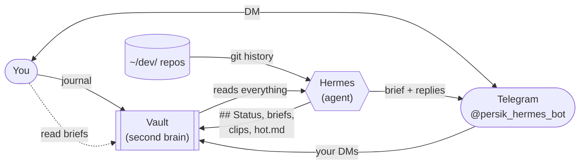

# Jackie OS: for friends (/docs/what-it-does)

## What it is [#what-it-is]

A **second brain** and an **always-on AI agent**, wired so the agent knows what's in the brain.

The second brain is your Obsidian vault: every journal entry, project note, decision, and idea, linked and versioned in git. It compounds over time. The agent (Hermes) lives on a server in Germany, runs 24/7, reads the vault before acting, and delivers results back to Telegram.

You think and decide. The brain remembers. The agent acts.

***

## The problem this solves [#the-problem-this-solves]

Every time you open ChatGPT or Claude, it starts with zero context. You re-explain your projects, your priorities, what you shipped last week. The AI helps inside a session. Across sessions it forgets.

Most people also keep this split:

* Notes (diary, ideas, plans) in one app
* Code projects in separate folders
* AI in a chat window that forgot everything

Nothing shares memory. Jackie OS makes all three read from the same source.

***

## The second brain (vault) [#the-second-brain-vault]

The vault is a folder of markdown files you open in [Obsidian](https://obsidian.md). Notes link to each other like Wikipedia: `[[Newfin]]`, `[[Warsaw]]`, `[[2026-06-20]]`. Over time you get a web: journal connects to projects, projects connect to decisions, decisions connect to people.

What lives there:

| Written by you           | Written by the agent                              |
| ------------------------ | ------------------------------------------------- |
| Daily journal            | Morning brief + weekly / monthly / yearly reviews |
| Project ideas, decisions | Project `## Status` (synced from code)            |
| Notes on people, places  | Clippings (links you sent) + person profiles      |
| Beliefs, theses          | Coaching notes, link suggestions, `hot.md` cache  |

**hot.md** is the key mechanism: after every sync, the agent writes a fresh \~500-word summary of what's currently active. Every AI session (Cursor, Claude Code, Hermes) reads this first. Context holds because there's a standing summary of where you are.

The vault is git-versioned. Nothing gets lost. The agent never edits your journal entries. It only appends to the end, or writes into its own files.

Every file also carries a little structured metadata (`type`, `title`, `date`) in a format called **OKF** (Open Knowledge Format). You never see it, but it makes the vault *portable*: not locked to any one tool: and lets any agent orient and retrieve by metadata instead of guessing from prose.

***

## What it actually does [#what-it-actually-does]

The system isn't one feature. It's a set of jobs the agent does for you, all reading from and writing to the same second brain.

**Vaulting & linking** means keeping one git-versioned source of truth *and* weaving it into a graph. Every note, brief, and decision lives in the vault; nothing is scattered or lost. After each brief, the agent also suggests links between notes you wrote: "this journal entry relates to \[\[Newfin]], to \[\[Warsaw]]": so over time the vault becomes a connected web, not a pile of files.

**Capturing** means pulling stuff *into* the brain without friction. DM the Telegram bot a thought → it lands in today's journal within the hour. Send a link → it gets filed into Clippings. Type `meet Sarah:` with notes → it creates a meeting entry *and* a person note for Sarah.

**Briefing** means telling you where you are. Morning brief (daily), weekly review (Sunday), monthly and yearly reviews. Each reads the vault + your code and summarizes what changed, what's next, what's blocked.

**Syncing** means keeping code and notes in agreement. The agent reads git history from your repos and writes it into each project's `## Status` note, so the vault always reflects what actually shipped.

**Building:** you write code in **Cursor**. Hermes tracks merges and syncs Status. It does not run a coding-agent farm on the VPS.

**Researching** means digging on demand. Say `research &lt;topic>` and it sweeps Reddit, HN, X, markets (last 30 days) and files the findings into the vault.

**Coaching** is the reflective layer. Recovery, identity, and "fractal" period reviews: week, month, year: where the agent takes a coach stance and walks you through patterns instead of just reporting facts.

**Enriching** means filling in context. New person shows up in your notes? The agent pulls a public profile and adds a `## Public profile` section to their note.

Each of these is a **skill**: a markdown playbook the agent follows. They all share the same vault, so capturing feeds briefing, briefing feeds coaching, and nothing has to be re-explained between them.

***

## The agent (Hermes) [#the-agent-hermes]

The jobs above are *what* it does. Hermes is *who* does the always-on ones: not a chatbot you open. It runs 24/7 on a server, works on a schedule while you sleep, and you can reach it any time by DMing `@persik_hermes_bot` on Telegram. It wears the **COO** hat (briefs, sync, research, journal). **CTO work is Cursor** on the laptop or PC. Hermes is not a coding-agent farm.

Three things make it an agent rather than a script:

* **It runs itself.** A schedule on the server fires the jobs: morning brief at 07:30, journal capture hourly, weekly review Sunday. Your Mac can be off and traveling; the loop still runs.
* **It follows playbooks, not hardcode.** Each job is a **skill**: a markdown file in `System/skills/` that lives *in the vault*. You read and edit them like any other note. Change the playbook, change the behavior.
* **It's not a black box.** Everything it reads comes from the vault; everything it writes goes back to the vault. The full chain is auditable: no hidden state.

There's a second, separate bot: `@Persik_finbot`: that handles money and finance for the Newfin app. Hermes (`@persik_hermes_bot`) is the one that runs your OS.

***

## Hermes is optional: it lives in a folder [#hermes-is-optional-it-lives-in-a-folder]

Hermes is the *always-on* layer: it runs the schedule on a server while you sleep. But you don't need it to use Jackie OS.

At its core, Jackie OS is just a folder of files: your notes, the skills, the rules. The daily desk is **Cursor**. Open that folder in Cursor (or Claude Code / Codex) and that tool *becomes* a Jackie OS agent. It auto-reads the same `CLAUDE.md` / `AGENTS.md` rules the moment the folder is open, and the skills are right there inside it. (A few cross-project skills like **wrap up** are installed once on your Mac, so they work in every project.) Grokbot is a side chat. It does not write git.

Nothing "migrates": you just connect the folder. Say **wrap up** from any of these tools and the vault syncs, project `## Status` blocks update, `hot.md` refreshes, and the changes commit: exactly the loop Hermes runs, just triggered by hand.

So: **Hermes = the schedule** (automation while you sleep). &#x2A;*Your IDE + the folder = the same system, on demand.** Same brain either way.

***

## How they connect [#how-they-connect]

It's a loop, not a pipeline. You feed the vault (journaling, DMs, code). Hermes reads the vault + git, does its jobs, writes back to the vault, and pings you on Telegram. Your DMs flow back into the vault. Round and round.

The glue is **hot.md**. When *any* Claude session starts: terminal, Cursor, Hermes: it reads hot.md first and walks in knowing your current focus, last merge, what's pending. That's the trick that kills the cold start.

For the system diagram, see the docs site "The system map" page.

***

## How a day actually feels [#how-a-day-actually-feels]

**07:30*&#x2A;: Hermes wakes up (you're asleep), reads all your code repos, sees what merged, syncs project status notes, writes the brief, sends it to your Telegram. Done before you check your phone. &#x2A;(Research is on-demand now: say `research &lt;topic>` whenever you want it; it no longer runs unattended at 06:45.)*

**Morning**: You read the brief over coffee. Reply to Hermes via Telegram DM if you want to add something to your journal. It captures it within the hour.

**Day**: You work, code, journal in Obsidian. When you finish a planning session or push code, say **wrap up**: Hermes syncs the vault immediately.

**Sunday 18:00**: Weekly review runs automatically. Patterns, what compounded, what to carry forward.

**Nothing requires you.** The morning stack runs on the VPS even when your Mac is off and you're traveling.

***

## What the agent is allowed to touch [#what-the-agent-is-allowed-to-touch]

**Yes:**

* Write briefs and reviews into `Vault/Briefs/`
* Update `## Status` blocks in project notes
* Append to today's journal (Telegram capture only: end of file)
* Refresh `hot.md` after every sync

**Never:**

* Edit the body of your journal entries
* Touch notes tagged `private`
* Rename vault notes (that breaks Obsidian links: human-only)
* Put credentials in any markdown file

***

## The commands (everything else is automatic) [#the-commands-everything-else-is-automatic]

The schedule covers the daily loop. These are the things you trigger by hand:

| Say                                  | What it does                                                                       |
| ------------------------------------ | ---------------------------------------------------------------------------------- |
| **wrap up**                          | After vault work or a code push: syncs everything now instead of waiting for 07:30 |
| **sync projects**                    | Quick mid-session "where are we?" status check                                     |
| **research \<topic>**                | Deep community/market dig (Reddit, HN, X, markets) filed into the vault            |
| **morning brief**                    | Trigger the brief now instead of waiting                                           |
| **coach me**                         | Reflective session: recovery, identity, patterns                                   |
| **weekly / monthly / yearly review** | Run a period review on demand instead of waiting for its schedule                  |

The morning stack, hourly journal capture, and Sunday review all run on their own: you never trigger those.

***

## The tools, in plain words [#the-tools-in-plain-words]

None of these need to be understood to use the system: but here's what each one is, in one line:

| Tool         | What it is                                                                                                                                                                                               |
| ------------ | -------------------------------------------------------------------------------------------------------------------------------------------------------------------------------------------------------- |
| **Obsidian** | A free notes app. Your vault is just a folder of plain text files it opens.                                                                                                                              |
| **Markdown** | Plain text with simple formatting (like `**bold**`). Future-proof: opens anywhere, forever.                                                                                                              |
| **Git**      | A time machine for files. Every change is saved and reversible; nothing is ever truly lost.                                                                                                              |
| **VPS**      | A small computer rented in a data center that never sleeps: so the agent runs even when your laptop is closed.                                                                                           |
| **Claude**   | The AI model (by Anthropic) that does the actual thinking, writing, and coding.                                                                                                                          |
| **Hermes**   | The program that turns Claude into an always-on assistant living on the VPS.                                                                                                                             |
| **Telegram** | The messaging app you use to talk to the agent (the bot is called Persik).                                                                                                                               |
| **Skill**    | A markdown file of instructions telling the agent how to do one job. Editable like any note.                                                                                                             |
| **OKF**      | Open Knowledge Format: structured metadata (`type`, `title`, `date`) on every file. Makes the vault a portable, vendor-neutral bundle any agent can orient in and retrieve from: not locked to one tool. |

***

## The core idea in one line [#the-core-idea-in-one-line]

**Your thinking goes into the vault. The agent reads it, acts on it, and keeps it current. You never start from zero.**

***

*Updated 2026-06-29: morning stack on VPS Hermes cron; Mac Cowork is weekly-review only.*
